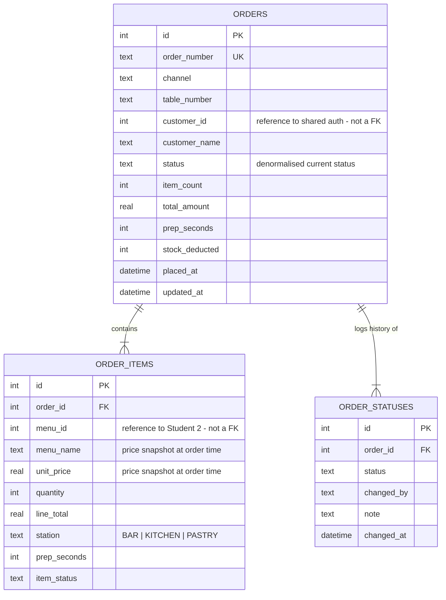

# Student 4 — Order & Kitchen Management

**Stella Kwon · 14608208 · 41026 Advanced Software Development · Release 0**

Three containerised microservices covering the ordering half of the cafe
system: taking an order at the counter, running it through the kitchen, and
using AI-Mode to decide what to make next.

---

## 1. What is in this folder

```
student-4/
├── frontend/            POS · Kitchen Display · Order Status   (Flask + HTMX, :5400)
│   ├── app.py           routes + HTMX partials, calls the backend over HTTP
│   ├── templates/       base, three pages, nine partials
│   └── static/          order.css (my theme layer) + vendored htmx 2.0.10
├── backend/             Business logic + AI-Mode                (Flask, :8400)
│   ├── app.py           /api/* endpoints, status lifecycle rules
│   ├── clients.py       every outbound call: db, menu, inventory, ollama
│   ├── ai.py            queue metrics, prompt building, LLM + fallback
│   └── menu_catalog.json  fallback price cache + kitchen attributes
├── database/            Owns orders.db                          (Flask, :7400)
│   ├── schema.sql       orders · order_items · order_statuses
│   ├── seed.py          12 orders, 28 items, 42 status rows
│   └── app.py           /db/* CRUD API — the only door to the SQLite file
├── agentic/             Plan → Act → Observe → Adapt review loop + logs
├── prompts/             Prompt asset register (4 assets, versioned)
└── tests/               42 tests + mock_peers.py test double
```

## 2. Architecture

```
                    ┌──────────────────────────────────────┐
  browser  ────────▶│  student-4-frontend            :5400 │
                    │  POS · Kitchen Display · Status      │
                    │  Flask + HTMX, no database           │
                    └──────────────┬───────────────────────┘
                                   │ HTTP  (BACKEND_URL)
                    ┌──────────────▼───────────────────────┐
                    │  student-4-backend             :8400 │
                    │  order rules · status lifecycle      │
                    │  AI-Mode prompt building             │
                    └──┬────────┬────────┬─────────────┬───┘
                       │        │        │             │
      DB_SERVICE_URL   │        │        │             │  OLLAMA_URL
                       │        │        │             │
        ┌──────────────▼──┐  ┌──▼─────┐ ┌▼──────────┐ ┌▼─────────────┐
        │ student-4-      │  │Student2│ │ Student 3 │ │ ollama :11434│
        │ database  :7400 │  │Menu API│ │Inventory  │ │ llama3.2 /   │
        │ ┌─────────────┐ │  │ :8200  │ │ API :8300 │ │ qwen2.5      │
        │ │  orders.db  │ │  └────────┘ └───────────┘ └──────────────┘
        │ └─────────────┘ │
        └─────────────────┘
         only this container
         opens the SQLite file
```

**Two rules the design is built on.**

1. **`orders.db` has exactly one owner.** `backend/` contains no `import
   sqlite3` — every read and write goes through `http://student-4-database:7400/db/*`.
   The agentic loop enforces this on every CI run (`no_direct_sqlite` probe).
2. **Cross-feature data is fetched, never joined.** Menu prices come from
   Student 2's `/api/menus`; stock is checked and deducted through Student 3's
   `/api/inventory/check` and `/api/inventory/deduct`. No query in this feature
   touches another student's tables.

## 3. Running it

### With Docker (the way it is marked)

From the repository root:

```bash
docker compose up -d --build student-4-database student-4-backend student-4-frontend
docker compose ps
```

| Screen | URL |
| --- | --- |
| POS order placement | http://localhost:5400/pos |
| Kitchen display | http://localhost:5400/kitchen |
| Order status | http://localhost:5400/status |
| Backend health | http://localhost:8400/api/health |
| Database health | http://localhost:7400/db/health |

### Opening it from another device

Every link between the shared entry point and this feature is built from the
host the **browser** used, not from `localhost`. Open the shared app at
`http://<the host machine's IP>:5100` from a phone or a second laptop on the
same network and the dashboard cards, and the "Staff Dashboard" link back,
all point at that same IP automatically. Nothing needs reconfiguring.

```bash
ipconfig getifaddr en0        # macOS - find the host IP
hostname -I                   # Linux
# then browse to http://<that IP>:5100 from any device on the network
```

`SHARED_PORT` (default 5100) changes which port the back-link uses;
`SHARED_HOME_URL` pins it to one fixed address if that is ever wanted.

If another device cannot connect, it is the host firewall, not the app -
ports 5100 / 5400 / 8400 / 7400 have to be reachable.

For AI-Mode, bring up the model too:

```bash
docker compose up -d ollama ollama-init      # pulls llama3.2 on first run
OLLAMA_MODEL=qwen2.5 docker compose up -d ollama-init   # or the second approved LLM
```

The whole team application (all five features plus the shared entry point at
:5100) starts with `docker compose up --build` once the other students
uncomment their blocks in `docker-compose.yml`.

### Without Docker

```bash
cd student-4
pip install -r backend/requirements.txt -r frontend/requirements.txt

./run_local.sh                 # seeds on first run, starts all three services
./run_local.sh --reset --mock  # wipe + re-seed, and start the peer test doubles
./run_local.sh --stop
```

Logs go to `/tmp/s4-*.log`.

### Demonstrating the integration before Students 2 and 3 are ready

```bash
python tests/mock_peers.py        # Menu API on :8200, Inventory API on :8300
```

`tests/mock_peers.py` serves the two contracts my backend calls. With it
running, `/api/menu` reports `"source": "menu-service"`, prices arrive from the
Menu API, and an order for 5 Avocado Toasts is rejected with a stock shortage.
With it stopped, the same screens keep working from the fallback cache and the
order is saved with `stock_deducted = 0`. It is a test double — never deployed.

## 4. API reference

### Backend/API — `student-4-backend:8400`

| Method | Path | Purpose |
| --- | --- | --- |
| GET | `/api/health` | service + every dependency |
| GET | `/api/menu` | menu with live prices, `source` says where from |
| GET | `/api/orders` | list, `?status=` `?channel=` `?limit=` |
| POST | `/api/orders` | **C** — prices from Student 2, stock via Student 3 |
| GET | `/api/orders/<id>` | **R** — order + items + status history |
| PUT | `/api/orders/<id>` | **U** — table, customer, note |
| DELETE | `/api/orders/<id>` | **D** — refused with 409 once PREPARING |
| POST | `/api/orders/<id>/items` | add a line to an open order |
| PUT | `/api/order-items/<id>` | change quantity / status, total recalculated |
| DELETE | `/api/order-items/<id>` | remove a line |
| GET | `/api/order-status` | kitchen board grouped by status |
| GET | `/api/order-status/<id>` | current status + allowed next + history |
| PUT | `/api/order-status/<id>` | advance the lifecycle |
| GET | `/api/kitchen/queue` | deterministic queue metrics |
| POST | `/api/ai/kitchen-analysis` | **AI-Mode** |

### Database — `student-4-database:7400`

`/db/health` · `/db/stats` · `/db/orders` (GET, POST) ·
`/db/orders/<id>` (GET, PUT, DELETE) · `/db/orders/<id>/items` (GET, POST) ·
`/db/order-items/<id>` (PUT, DELETE) · `/db/orders/<id>/statuses` (GET, POST) ·
`/db/order-statuses` (GET) · `/db/order-statuses/<id>` (DELETE)

## 5. Data design

**Conceptual.** A customer places an **Order** at a channel (dine-in or
takeaway). An order is made of **Order Items**, each one a quantity of a menu
item owned by Student 2. An order moves through a lifecycle, and every move is
recorded as an **Order Status** entry.

**ERD**



**Logical → physical.** Third normal form inside my own boundary, with three
deliberate exceptions, each justified in
[`prompts/04-data-design-review.md`](prompts/04-data-design-review.md):

- `menu_name` / `unit_price` are **snapshots**, not duplication — a receipt
  must not change when Student 2 re-prices the menu.
- `orders.status` **denormalises** the latest `order_statuses` row, because
  the kitchen board re-reads every ticket every 15 seconds.
- `customer_id` and `menu_id` are plain integers. A foreign key cannot cross a
  service boundary; only `order_id` is a real FK, with `ON DELETE CASCADE`.

**Seeded on first boot:** 12 orders · 28 order items · 42 status rows —
past the 10+ requirement on all three tables, and spread across the lifecycle
so the kitchen board is populated the moment the container starts.

## 6. AI-Mode

**Request path:** Frontend → Backend/API → Ollama → Llama 3.2 / Qwen 2.5 →
Backend → Frontend, exactly as the brief specifies. Callable from the Kitchen
Display with the **Analyse kitchen now** button.

**What it does.** `summarise_queue()` computes deterministic metrics from the
live queue — workload per station, ticket ages, a priority score per ticket,
a congestion level. Those metrics, not raw rows, become the prompt. The model
supplies the judgement: congestion in one sentence, a recommended preparation
sequence with reasons, delay risks, and one instruction for right now.

**Why the numbers are computed in Python.** Language models are unreliable at
arithmetic and ordering. Giving the model figures it only has to quote is what
stopped it inventing times — see the v1 → v2 story in
[`prompts/01-kitchen-analysis.md`](prompts/01-kitchen-analysis.md).

**When Ollama is down** the endpoint still answers, with `mode: "heuristic"`
and the same output shape from `heuristic_analysis()`. The panel shows a badge
saying which path ran, so nothing is hidden from the marker.

The AI panel exposes the exact prompt under *"Show the exact prompt sent to the
model"* — the context-management evidence is visible in the running app.

## 7. Tests and CI

```bash
cd student-4
python -m pytest tests -q                     # 29 unit tests, no containers
S4_DB_URL=http://localhost:7400 \
S4_BACKEND_URL=http://localhost:8400 \
S4_FRONTEND_URL=http://localhost:5400 \
python -m pytest tests -q                     # 42 tests including integration
python agentic/loop.py                        # 16/16 probes
```

| File | Covers |
| --- | --- |
| `test_database_api.py` | every CRUD path, validation, cascade delete, total recalculation, stats |
| `test_ai_mode.py` | queue metrics, priority ordering, at-risk detection, LLM parsing, Ollama-down fallback, prompt hygiene |
| `test_integration.py` | the three containers, the three screens, a full create→read→update→status→delete round trip, illegal transitions, AI endpoint |

`.github/workflows/student-4.yml` runs three jobs on every push that touches
this folder: **unit-tests** (compile, pyflakes, seed validation, pytest) →
**build** (all three images, in parallel) → **validate** (compose up, wait for
health, integration tests, screen checks, agentic loop, logs uploaded as an
artifact).

## 8. What I depend on, and what depends on me

| Direction | Service | Contract |
| --- | --- | --- |
| I call | Student 2 — Menu | `GET /api/menus` → `[{menu_id, name, price, available}]` |
| I call | Student 3 — Inventory | `POST /api/inventory/check` and `/deduct` → `{available, shortages}` |
| I call | Ollama | `POST /api/generate` |
| Calls me | Student 5 — Payment | `GET /api/orders/<id>` for the total, `PUT /api/order-status/<id>` to mark COMPLETED after payment |
| Shared | Authentication | `customer_id` / `customer_name` snapshotted onto the order |

`MenuClient._normalise()` accepts several plausible response shapes
(`[...]`, `{"menus": [...]}`, `{"data": [...]}`, and `id`/`menu_id`,
`price`/`unit_price`), so Student 2's exact field naming will not break the
integration on demo day.

## 9. Known issues and limitations

- **No authentication on my own endpoints yet.** The shared login exists at
  :5100, but `student-4-backend` does not verify a session — any caller on the
  Docker network can place an order. Release 1: accept the shared session
  cookie and populate `customer_id` / `staff_id` from it rather than from the form.
- **`stock_deducted = 0` is recorded but not reconciled.** If Student 3's
  service is down at order time the flag is set correctly, but nothing retries
  the deduction later. Release 1: a reconciliation endpoint.
- **The fallback price cache can drift.** If Student 2 changes a price while
  their service is down, my fallback serves the old one. Prices are tagged with
  `price_source` so the drift is visible, but there is no expiry.
- **LLM output is non-deterministic.** Two analyses of the same queue can be
  worded differently. The metrics beside the narrative are deterministic, which
  is what the staff should trust.
- **Single-host deployment.** One `docker compose` on one machine; SQLite would
  need replacing before more than one instance of the database service could run.
- **The kitchen board polls every 15 seconds** rather than pushing. Fine at this
  scale; server-sent events would be the Release 1 answer.
