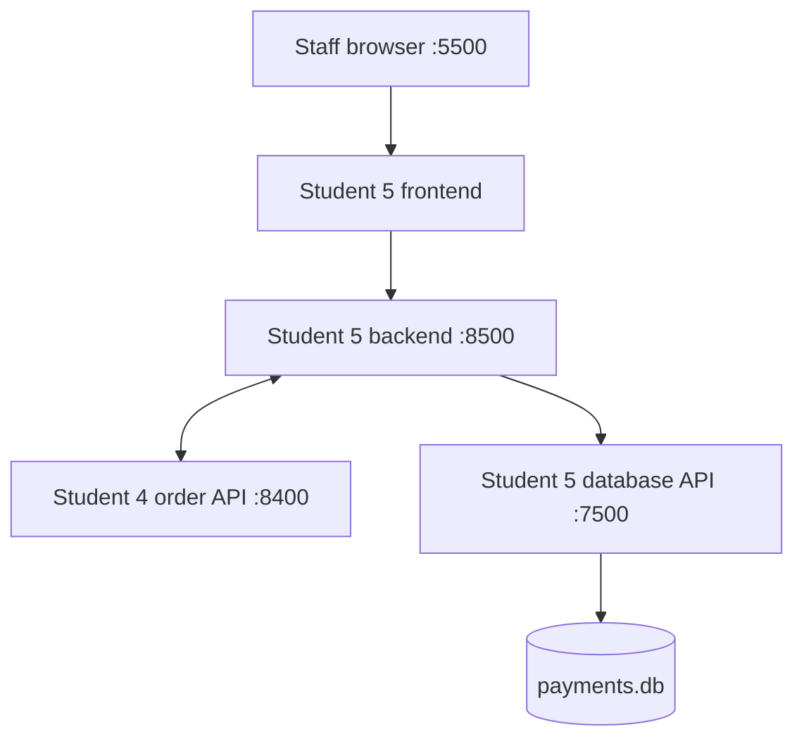
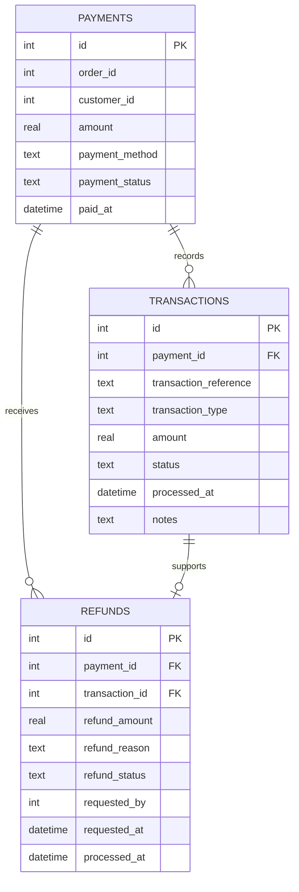

# Student 5 – Payment & Billing

**Ong Ath Vongnathi (Kota) · 41026 Advanced Software Development**

Three containerised microservices responsible for payment processing, transaction recording, refund handling, and payment data storage for the Cafe Management Assistant.

---

## 1. What is in this folder

```text
student-5/
├── frontend/
│   ├── index.html              Staff payment and refund dashboard
│   └── Dockerfile              Frontend container configuration
├── backend/
│   ├── app.py                  Payment and refund business logic
│   ├── requirements.txt        Backend Python dependencies
│   └── Dockerfile              Backend container configuration
├── database/
│   ├── app.py                  Database CRUD API
│   ├── schema.sql              SQLite table definitions
│   ├── seed.py                 Creates and seeds the payment database
│   ├── requirements.txt        Database API dependencies
│   └── Dockerfile              Database container configuration
├── tests/
│   ├── test_backend_api.py     Backend payment and refund tests
│   └── test_database_api.py    Database CRUD API tests
├── .gitignore                  Excludes generated files
└── README.md                   Student 5 documentation
```

The generated `payments.db` file and Python cache files are excluded from Git.

---

## 2. Architecture



The frontend never accesses SQLite directly. It sends HTTP requests to the backend.

The backend contains the payment and refund business rules. It sends HTTP requests to the database microservice.

Only the database microservice directly opens `payments.db`.

---

## 3. Responsibilities

### Frontend

The frontend provides a staff-facing Payment & Billing dashboard that can:

- Check backend availability
- Display payment records
- Process a payment
- Submit a partial or full refund
- Refresh payment information automatically

Authentication is owned by the shared team application. This service does not create a separate login system.

### Backend

The backend:

- Validates payment requests
- Supports card, cash, and digital-wallet payments
- Creates payment transaction references
- Completes payment records
- Validates refund requests
- Prevents refunds exceeding the remaining payment amount
- Supports partial and full refunds
- Updates payment status after a refund
- Communicates with the database through HTTP only

### Database service

The database service:

- Owns the SQLite database
- Provides CRUD endpoints for payments, transactions, and refunds
- Enforces foreign-key relationships
- Returns JSON responses to the backend
- Seeds demonstration records

---

## 4. Running with Docker

From the repository root:

```bash
docker compose up --build -d student-5-database student-5-backend student-5-frontend
```

Check the containers:

```bash
docker compose ps student-5-database student-5-backend student-5-frontend
```

The three containers should report `healthy`.

| Service | URL |
|---|---|
| Staff payment dashboard | http://localhost:5500 |
| Backend health | http://localhost:8500/health |
| Database health | http://localhost:7500/health |
| Backend payments | http://localhost:8500/api/payments |
| Database payments | http://localhost:7500/api/payments |

Stop the Student 5 containers:

```bash
docker compose stop student-5-frontend student-5-backend student-5-database
```

Remove the Student 5 containers:

```bash
docker compose rm -f student-5-frontend student-5-backend student-5-database
```

---

## 5. Running without Docker

Install the database dependencies:

```bash
python -m pip install -r student-5/database/requirements.txt
```

Install the backend dependencies:

```bash
python -m pip install -r student-5/backend/requirements.txt
```

Create the database:

```bash
python student-5/database/seed.py
```

Start the database API:

```bash
python student-5/database/app.py
```

Start the backend in a second terminal:

```bash
python student-5/backend/app.py
```

Start the frontend in a third terminal:

```bash
python -m http.server 5007 --directory student-5/frontend
```

The Docker configuration is recommended because it automatically configures service ports and container networking.

---

## 6. Backend API reference

Backend container address: `student-5-backend:8500`

| Method | Path | Purpose |
|---|---|---|
| GET | `/health` | Check backend and database connection |
| GET | `/api/payments` | List payment records |
| GET | `/api/payments/<id>` | Retrieve one payment |
| POST | `/api/payments/process` | Process a new payment |
| GET | `/api/refunds` | List refund records |
| POST | `/api/refunds` | Process a partial or full refund |

### Process-payment request

```json
{
  "order_id": 1011,
  "customer_id": 11,
  "amount": 18.50,
  "payment_method": "card"
}
```

Accepted payment methods:

- `card`
- `cash`
- `digital_wallet`

### Process-refund request

```json
{
  "payment_id": 11,
  "refund_amount": 5.00,
  "refund_reason": "Customer changed order",
  "requested_by": 11
}
```

---

## 7. Database API reference

Database container address: `student-5-database:7500`

The database service provides CRUD operations for these resources:

- `payments`
- `transactions`
- `refunds`

| Method | Path | Purpose |
|---|---|---|
| GET | `/health` | Check database service health |
| GET | `/api/<resource>` | List all records |
| GET | `/api/<resource>/<id>` | Retrieve one record |
| POST | `/api/<resource>` | Create a record |
| PUT | `/api/<resource>/<id>` | Update a record |
| DELETE | `/api/<resource>/<id>` | Delete a record |

---

## 8. Data design



The database is seeded with:

- 10 payments
- 10 transactions
- 10 refunds

---

## 9. Tests

Run all Student 5 automated tests from the repository root:

```bash
python -m pytest student-5/tests -v
```

Current test result:

```text
14 passed
```

| Test file | Coverage |
|---|---|
| `test_database_api.py` | Health, create, read, update, delete, and required-field validation |
| `test_backend_api.py` | Health, payment processing and validation, refunds, order-total validation, and Student 4 status integration |

The tests use temporary or mocked database responses and do not modify the normal seeded database.

---

## 10. Service integration

Student 5 currently receives `order_id` and `customer_id` values in payment requests.

The implemented team integration is:

- Student 5 retrieves the order from Student 4.
- Student 5 verifies that the submitted payment amount matches the order total.
- Student 5 rejects completed or cancelled orders.
- After successful payment, Student 5 requests that Student 4 mark the order as completed.
- If the status update fails, the payment remains recorded and the response includes an integration warning.

The Student 5 database stores external order and customer identifiers as integers because foreign-key constraints cannot cross independent microservice databases.

---

## 11. Known limitations

- The current frontend is intended for staff/admin use.
- Authentication and role enforcement belong to the shared team application and are not yet enforced directly by the Student 5 backend.
- Customer-specific payment history is not currently filtered by an authenticated session.
- Payment processing is simulated; it does not contact a real payment provider.
- The backend currently accepts order and customer identifiers supplied in the request.
- SQLite is appropriate for this university prototype but would require a more scalable database and secure deployment design for production use.
- The current Docker database is recreated from seed data when its image is rebuilt.
